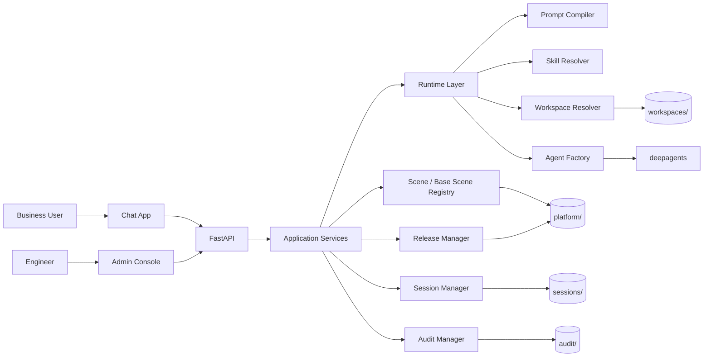

# Agent Platform Technical Design

Date: 2026-03-21
Status: Draft v1
Scope: Internal multi-scene agent platform, local-first implementation

## 1. Summary

This system is an internal B-end platform for defining and running multiple scene-specific agents. It has two user-facing surfaces:

- A minimal chat workspace for business users
- An admin console for engineers to define, publish, and observe scenes

The backend stack is:

- Python 3.12
- FastAPI
- deepagents
- File-system-first configuration and workspace storage

The V1 implementation goal is to run locally on a single machine without introducing a database or sandbox dependency. The architecture must preserve clean boundaries so the runtime backend can later migrate from local execution to a sandbox provider without changing API contracts or storage semantics.

## 2. Requirements

### 2.1 Functional Requirements

The platform must support:

1. Base scenes that define:
   - base system prompt
   - base skills
2. Business scenes that define:
   - model configuration
   - scene system prompt
   - bound workspaces
   - optional inheritance from a base scene
3. Scene publishing:
   - compile final prompt
   - resolve effective skills
   - resolve effective workspaces
   - create immutable release snapshots
4. Chat runtime:
   - load released scene snapshot
   - mount effective skills and workspaces
   - create deepagents runtime
   - stream assistant output
5. Admin management:
   - list base scenes and scenes
   - edit draft configuration
   - publish a new version
   - inspect release history

### 2.2 Non-Functional Requirements

1. Keep deployment simple for a team under 100 users
2. Avoid new persistent infrastructure in V1
3. Keep released behavior stable via snapshot-based publishing
4. Preserve a clean migration path to sandboxed execution
5. Make every critical decision inspectable on disk
6. Avoid binding the platform control plane to deepagents internals

## 3. Constraints and Assumptions

### 3.1 Known Constraints

- The repository is currently empty
- The user wants backend implementation based on `FastAPI + deepagents`
- Workspace management should be filesystem-first
- Runtime should run locally first
- Shell/code execution is required in the future behavior model

### 3.2 Assumptions

The frontend will be implemented as:

- React
- TypeScript
- Vite

This is an implementation assumption for the plan, not a locked business decision. It can be swapped later if needed, but the current plan assumes a SPA frontend because:

- the chat page needs streaming state
- the admin console needs multi-panel editing
- the platform will benefit from typed client contracts

## 4. High-Level Architecture

The recommended architecture is a modular monolith:

- one FastAPI application
- one React frontend
- one local storage layout
- one deepagents runtime integration layer



## 5. Layering Strategy

### 5.1 Control Plane vs Runtime Plane

The most important architectural boundary is:

- control plane = platform-owned
- runtime plane = deepagents-owned

The control plane includes:

- scene definitions
- base scene inheritance
- release compilation
- workspace bindings
- session metadata
- audit records
- admin APIs

The runtime plane includes:

- agent creation
- tool execution
- skill loading
- shell execution
- file operations in the runtime workspace

This boundary is intentional. deepagents should not become the platform's source of truth for scene configuration, publishing, or governance.

### 5.2 Why This Boundary Matters

This design keeps the platform stable if any of the following change later:

- local backend to sandbox backend
- on-disk workspace mounts to remote mounted storage
- base scene inheritance rules
- admin-side validation and policy rules

## 6. Core Decisions

### Decision 1: Modular monolith instead of microservices

Chosen:

- single FastAPI service
- domain-based modules

Why:

- the system has low current scale
- operational complexity is unnecessary
- file-based configuration favors a single process model

Trade-off:

- fewer deployment boundaries
- less parallel scaling flexibility

Mitigation:

- enforce module boundaries in code
- keep runtime, storage, and API concerns separate

### Decision 2: File-system-first control plane

Chosen:

- scenes, base scenes, releases, skills, sessions, and audit data live on disk

Why:

- simple to back up
- easy to inspect
- low operational overhead
- consistent with the user's workspace requirement

Trade-off:

- no transactional DB semantics
- more care needed for concurrent writes

Mitigation:

- admin writes remain low-frequency
- release artifacts are immutable
- use atomic file replacement for writes

### Decision 3: Use deepagents native skill system

Chosen:

- the platform manages skill assets and bindings
- the runtime uses deepagents native `skills=[...]`

Why:

- deepagents already supports the standard skill protocol
- it already handles progressive disclosure and skill loading behavior
- a duplicate platform-defined skill runtime would add complexity without user value

Trade-off:

- some runtime conventions are inherited from deepagents

Mitigation:

- keep a platform-level `SkillRecord` abstraction
- treat deepagents skill directories as runtime artifacts, not the control-plane schema

### Decision 4: Local execution first, sandbox later

Chosen:

- V1 runtime uses local backend in development
- the runtime interfaces are designed to allow later sandbox replacement

Why:

- local bring-up is the fastest way to validate the product loop

Trade-off:

- local execution is not production-safe for multi-user deployment

Mitigation:

- isolate execution behind `AgentFactory`
- isolate file access behind `WorkspaceResolver`
- treat local execution as development mode only

## 7. Storage Layout

The control plane layout:

```text
platform/
  base-scenes/
    <base-scene-id>/
      base-scene.toml
      system.md
      skills.json
  scenes/
    <scene-id>/
      scene.toml
      system.md
      model.json
      inherit.json
      workspace-bindings.json
  skills/
    <skill-id>/
      skill.toml
      artifact/
        SKILL.md
        scripts/
        assets/
  releases/
    <scene-id>/
      <version>/
        snapshot.json
        compiled-system.md
        effective-skills.json
        effective-workspaces.json
      current.json
  audit/
    YYYY-MM-DD.jsonl
```

The runtime and user data layout:

```text
workspaces/
  <workspace-id>/
    manifest.toml
    files/

sessions/
  <scene-id>/
    <user-id>/
      <session-id>.jsonl
```

## 8. Domain Model

### 8.1 BaseScene

Fields:

- `id`
- `name`
- `description`
- `status`
- `system_prompt_path`
- `skill_ids`

### 8.2 Scene

Fields:

- `id`
- `name`
- `description`
- `status`
- `base_scene_id | null`
- `model_config`
- `system_prompt_path`
- `workspace_bindings`

### 8.3 SkillRecord

Fields:

- `id`
- `name`
- `description`
- `status`
- `artifact_path`
- `risk_level`
- `tags`

### 8.4 Workspace

Fields:

- `id`
- `name`
- `root_id`
- `relative_path`
- `mode`
- `description`

### 8.5 ReleaseSnapshot

Fields:

- `scene_id`
- `version`
- `published_at`
- `base_scene_id`
- `compiled_system_prompt_path`
- `effective_skill_paths`
- `effective_tool_names`
- `effective_workspaces`
- `model_config`

### 8.6 SessionRecord

Fields:

- `session_id`
- `scene_id`
- `user_id`
- `release_version`
- `created_at`
- `messages`
- `tool_events`

## 9. Inheritance and Compilation Rules

V1 inheritance is intentionally narrow.

Only two parts are inherited from the base scene:

1. base system prompt
2. base skills

The compilation rules are:

1. `compiled system prompt = base prompt + "\n\n" + scene prompt`
2. `effective skill paths = [base skill artifacts..., scene skill artifacts...]`
3. `model config = scene-owned only`
4. `workspaces = scene-owned only`

This keeps inheritance legible and prevents hidden runtime coupling.

## 10. Release Model

Released behavior must be immutable.

The publish flow is:

1. load base scene and scene draft
2. validate required fields
3. compile final system prompt
4. resolve skill artifact paths
5. resolve workspace bindings
6. create `releases/<scene>/<version>/`
7. write snapshot artifacts
8. update `current.json`

Runtime reads only:

- `releases/<scene>/current.json`
- the resolved version folder

Runtime must not read mutable draft files.

## 11. Runtime Design

### 11.1 Runtime Services

The runtime layer should expose these services:

- `PromptCompiler`
- `SkillResolver`
- `WorkspaceResolver`
- `AgentFactory`
- `ChatRunner`

### 11.2 PromptCompiler

Responsibilities:

- load base and scene prompt files
- compile final system prompt
- produce preview for admin UI

### 11.3 SkillResolver

Responsibilities:

- resolve `base skill ids + scene skill ids`
- map them to deepagents skill artifact paths
- preserve precedence order: `base -> scene`

### 11.4 WorkspaceResolver

Responsibilities:

- map workspace bindings to effective runtime roots
- prepare the runtime-accessible directory map
- isolate local execution from control-plane directories

### 11.5 AgentFactory

Responsibilities:

- choose runtime backend based on mode
- create the deep agent using compiled artifacts
- inject tools, skills, prompt, and interrupt policy

The V1 runtime mode is:

- `local-dev`

Future mode:

- `sandbox`

## 12. Local Execution Strategy

V1 will run locally, but the design must not normalize host-wide execution.

Recommended local behavior:

- create a per-session runtime directory
- mount only effective workspace directories into the runtime view
- avoid giving the agent the platform root
- use a curated environment allowlist
- define explicit interruption policy for risky actions

This minimizes later migration cost when moving to a sandbox backend.

## 13. API Design

### 13.1 Admin APIs

Required endpoints:

- `GET /api/admin/base-scenes`
- `POST /api/admin/base-scenes`
- `GET /api/admin/base-scenes/{id}`
- `PUT /api/admin/base-scenes/{id}`

- `GET /api/admin/scenes`
- `POST /api/admin/scenes`
- `GET /api/admin/scenes/{id}`
- `PUT /api/admin/scenes/{id}`

- `POST /api/admin/scenes/{id}/preview-prompt`
- `POST /api/admin/scenes/{id}/publish`
- `GET /api/admin/scenes/{id}/releases`
- `POST /api/admin/scenes/{id}/releases/{version}/rollback`

- `GET /api/admin/workspaces`
- `POST /api/admin/workspaces`
- `GET /api/admin/skills`

### 13.2 Chat APIs

Required endpoints:

- `GET /api/chat/scenes`
- `GET /api/chat/scenes/{id}`
- `POST /api/chat/sessions`
- `GET /api/chat/sessions/{id}`
- `POST /api/chat/sessions/{id}/messages`
- `GET /api/chat/sessions/{id}/stream`

The chat message API should support streaming response transport. SSE is the simplest V1 choice.

## 14. Frontend Shape

The frontend will expose two routes:

- `/chat`
- `/admin`

Frontend state responsibilities:

- scene list loading
- prompt preview and draft form state
- publish and rollback actions
- streaming assistant message rendering
- session history browsing

The frontend does not own inheritance or prompt compilation logic; that remains on the backend.

## 15. Validation Rules

Publishing a scene should fail if:

- no scene name
- no model selected
- no scene prompt
- base scene selected but missing base artifacts
- any skill artifact path is missing
- any workspace binding is invalid

The admin UI should surface both:

- inline field validation
- publish-time blocking validation

## 16. Security and Safety Notes

Because V1 runs locally and includes shell/code execution in the intended capability model, there are explicit risks:

1. local backend can affect host files
2. shell execution can mutate system state
3. prompt-driven tool invocation can exceed intended bounds

Mitigations in V1:

- treat local runtime as developer-only mode
- keep runtime workspace isolated
- limit root visibility
- use explicit interruption policy for risky actions
- persist session and audit traces

The production-safe answer is a sandbox backend. The V1 design keeps that migration path open.

## 17. Risks and Mitigations

### Risk 1: File-based writes race in admin flows

Mitigation:

- single-process V1
- atomic replace on write
- immutable releases

### Risk 2: Local execution leaks beyond intended workspace

Mitigation:

- never run against the platform root
- isolate per-session runtime directories
- centralize path resolution

### Risk 3: Skill artifact drift between draft and released runtime

Mitigation:

- copy or lock resolved skill artifact paths into release metadata
- do not run against mutable draft directories in production mode

### Risk 4: Runtime contracts leak deepagents assumptions into admin UI

Mitigation:

- keep backend DTOs platform-native
- translate runtime details inside the runtime layer only

## 18. Recommended Backend Module Layout

```text
app/
  api/
    admin/
      base_scenes.py
      scenes.py
      workspaces.py
      skills.py
    chat.py
    deps.py
  core/
    settings.py
    runtime_mode.py
  domain/
    models.py
    validators.py
  services/
    base_scene_service.py
    scene_service.py
    release_service.py
    session_service.py
    workspace_service.py
    skill_service.py
  runtime/
    prompt_compiler.py
    skill_resolver.py
    workspace_resolver.py
    agent_factory.py
    chat_runner.py
  storage/
    file_store.py
    scene_repository.py
    release_repository.py
    session_repository.py
    workspace_repository.py
  schemas/
    admin.py
    chat.py
  main.py
```

## 19. ADR Summary

### ADR-001: Use modular monolith architecture

Status: Accepted

Reason:

- lowest operational cost for current scale

### ADR-002: Use filesystem-first control plane

Status: Accepted

Reason:

- matches operational simplicity goal

### ADR-003: Use deepagents native skills

Status: Accepted

Reason:

- avoids duplicating runtime skill behavior

### ADR-004: Treat local execution as development mode only

Status: Accepted

Reason:

- enables fast validation without blocking future sandbox adoption

## 20. Sources

The runtime recommendations above are aligned with official deepagents documentation:

- [Deep Agents Overview](https://docs.langchain.com/oss/python/deepagents/overview)
- [Deep Agents Skills](https://docs.langchain.com/oss/python/deepagents/skills)
- [Deep Agents Backends](https://docs.langchain.com/oss/python/deepagents/backends)
- [Deep Agents Human-in-the-loop](https://docs.langchain.com/oss/python/deepagents/human-in-the-loop)
- [Deep Agents Sandboxes](https://docs.langchain.com/oss/python/deepagents/sandboxes)
